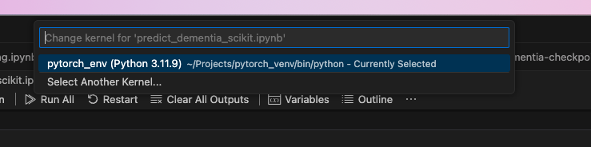
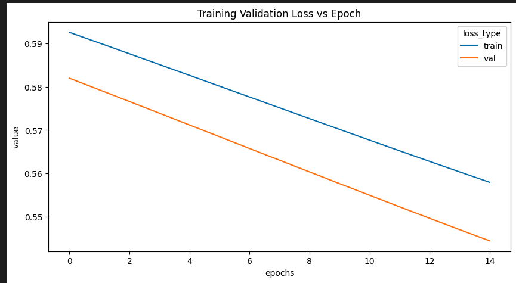
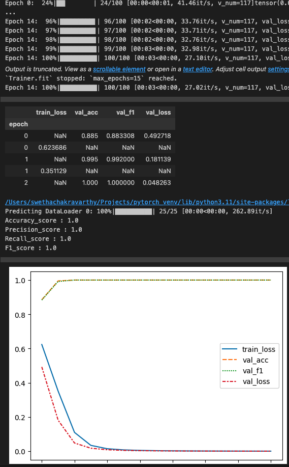

<p align="center">
  <a href="" rel="noopener">
 </a>
</p>

<h3 align="center">My First AI/ML Project</h3>

<div align="center">

[]()
[](https://github.com/kylelobo/The-Documentation-Compendium/issues)
[](https://github.com/kylelobo/The-Documentation-Compendium/pulls)
[](/LICENSE)

</div>

---

<p align="center"> Binomial Classiification Model to Predict Patient Dementia Risk
    <br> 
</p>

## 📝 Table of Contents

- [About](#about)
- [Getting Started](#getting_started)
- [Deployment](#deployment)
- [Usage](#usage)
- [Built Using](#built_using)
- [TODO](../TODO.md)
- [Contributing](../CONTRIBUTING.md)
- [Authors](#authors)
- [Acknowledgments](#acknowledgement)

## 🧐 About <a name = "about"></a>

This work has been my attempt to dive into the world AI/ML.

Dataset source: https://www.kaggle.com/datasets/timothyadeyemi/dementia-patient-health-dataset/data

## 🏁 Getting Started <a name = "getting_started"></a>

These instructions will get you a copy of the project up and running on your local machine for development.
### Prerequisites

```
- Latest versions of Visual Studio Code, Python & Jupyter Notebook are installed

```

### Installing


Check latest version of python is installed

```
python --version
```

Create New Virtual Environment and activate

```
python -m venv virtual_env
source virtual_env/bin/activate
```


Install IPython Kernel for Jupyter within the new Virtual Environment

```
pip install ipykernel
```


Register new IPy Kernel with Jupyter

```
python -m ipykernel install --user --name=virtual_env
```

Verify the new iPy Kernel is listed in the jupyter kernels

```
jupyter kernelspec list
```

Use the new jupyter iPython kernel to run the notebooks




## 🎈 Usage <a name="usage"></a>

- understand_data.ipynb 

``` 
- Reads health dataset into pandas dataframe

- create seaborn histogram plots to study the relationship of each feature to the target
```

- predict_dementia_scikit.ipynb

```
- Reads health dataset into pandas dataframe
- Preprocess the data using sklearn.preprocessing converting categorical data into numeric and replacing NaN values
- Perform standard scaling 
- split the data into training and validation sets
- create instance of LogisticRegression model and fit the model on training dataset
- Use the model to make predictions on validation dataset
- Report the classification metrics 

```

- predict_dementia_pytoch.ipynb
```
- Reads health dataset into pandas dataframe
- Drop features that wont affect the target
- Clean NaN values in the dataset
- split the data into training and validation sets
- Preprocess the training and validation dataset(converting categorical features into numeric and perform standard scaling on all the data)
- Convert training and validation numpy arrays to torch tensors
- Set batch size & Create instances of DataLoaders for training and validation datasets that will be used for training and validation
- Define a new Pytorch module LogisticRegressionNN with 2 hidden layers with corresponding ReLU activation functions, final output feeds into Sigmoid activation function
- Create an instance of LogisticRegressionNN, move it to cuda/mps/cpu device
- Create instance of loss function and the gradient descent optimizer that will be used for training
- For each epoch 
    -  iterate through all the batches of training data 
        - generate predictions passing the data through LogisticRegressionNN
        - apply the loss function to compute the loss
        - perform gradient on the loss computed
        - run the optimizer.step to update the weights. 
        - save training loss for the entire epoch 
    - iterate through all the batches of validation data
        - generate predictions passing the data through LogisticRegressionNN
        - apply the loss function to compute the loss
        - calculate accuracy metric
        - save validation loss for the entire epoch 
- Draw a plot of the training and validations losses for each epoch
- Evaluate the model that was trained by running the validation dataset through the LogisticRegressionNN and get the predictions

```


- predict_dementia_pl.ipynb
```
Use Pytorch Lightning to improve the code in predict_dementia_pytoch.ipynb

```


## ⛏️ Built Using <a name = "built_using"></a>

- [ScikitLearn](https://scikit-learn.org/)
- [Pytorch](https://pytorch.org/)
- [Pytorch Lightning](https://lightning.ai/docs/pytorch/stable/)

## ✍️ Authors <a name = "authors"></a>

- [@swchak](https://github.com/swchak) - Idea & Initial work

See also the list of [contributors](https://github.com/swchak) who participated in this project.

## 🎉 Acknowledgements <a name = "acknowledgement"></a>

- Hat tip to anyone whose code was used
- Inspiration
- References
